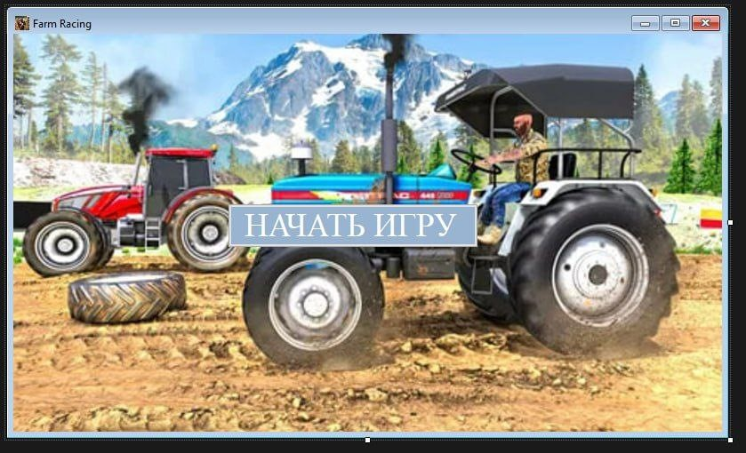
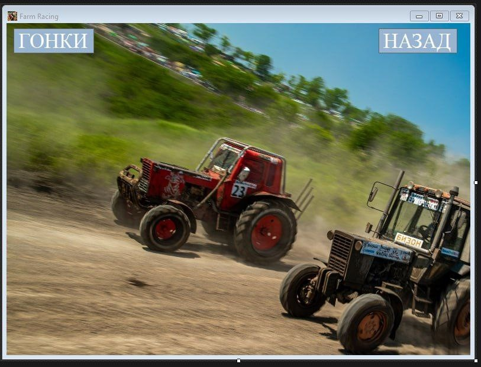
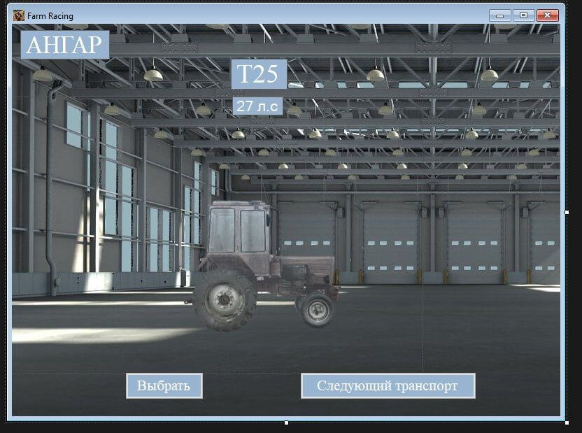
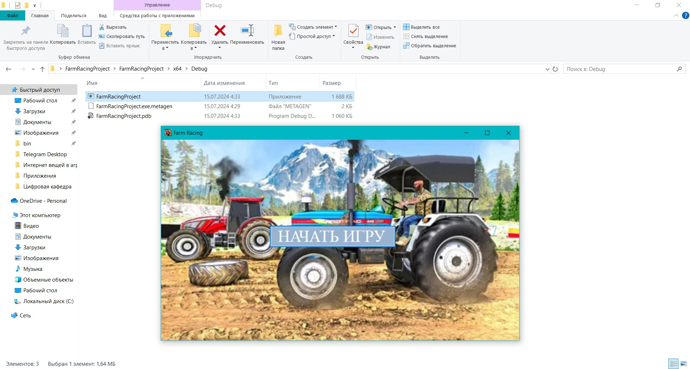

# Farm Racing

## Описание программы «Применение объектно-ориентированного программирования для визуализации и кастомизации с/х техники»

  Применение объектно-ориентированного программирования для визуализации и кастомизации с/х техники (Farm Racing) – это простая и развлекательная программа, в которой можно почувствовать себя настоящим водителем гоночного трактора. Программа предназначена для людей всех возрастов, выбирайте трактор, прокачивайте и конкурируйте с опытными соперниками.
## Основные функции программы:
1.	Покупка трактора
В игре представлены разнообразные модели тракторов, которые можно приобрести за внутриигровую валюту.
2.	Улучшение трактора
После приобретения трактора, можно настроить и улучшить трактор, добавив мощности двигателю и/или изменив внешний вид трактора.
3.	Гонка
Добро пожаловать в гонки на тракторах. Возможность выбрать свой мощный трактор и сразиться в гонке с другим соперником на более или менее мощном тракторе. 
 
 
 
 

 

## Преимущества программы Farm Racing:
Простота: интуитивно понятный интерфейс.
Удобство: быстрота и доступность функционала программы.
Гибкость: разнообразие тракторов с различными характеристиками и уникальным улучшением внешнего вида и настройками мощности.
## Инструкция по скачиванию:
1.	Нажмите кнопку Code
2.	В сплывающем меню выберете Dowload ZIP
3.	Разархивируйте архив на рабочем столе
4.	Переходим по пути x64/Debug/
  
5.	Запустите файл FarmRacingProject.exe
  
6.	Приступайте к использованию программы

## Стек технологий:
Среда разработки: Visual Studio

Язык программирования: С++

## Авторы проекта
[SurovcevMV](),

[GaijlisMYa](),

[NovikovaAE](https://github.com/NovikovaAE)

